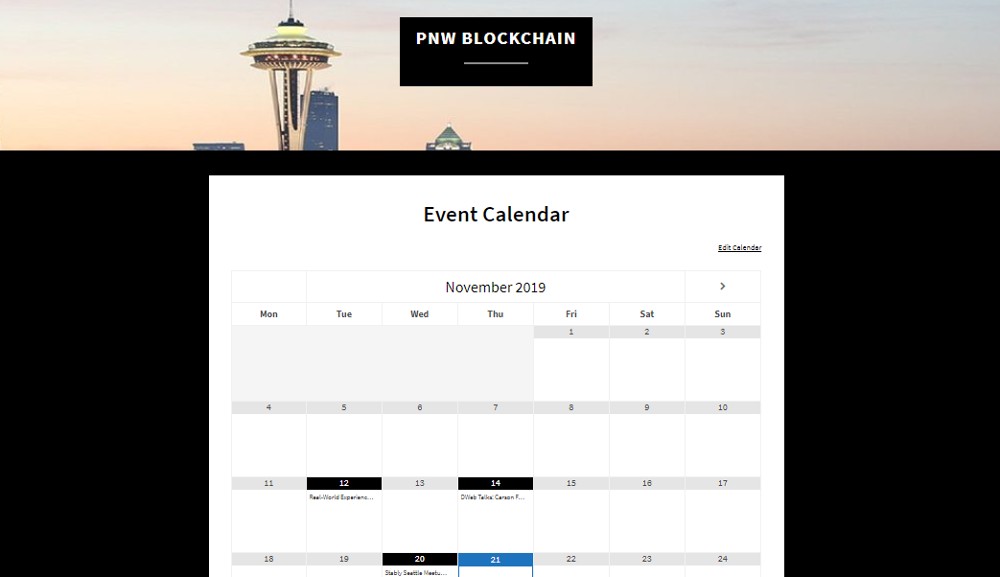

## Copywriting

### Informative Blogs

From thoughts leadership and journalism to product guides and community updates, Seth's articles keep audiences in touch with emerging
technologies and the people behind them.

View Seth's publications <a href="https://docs.google.com/spreadsheets/d/13bRyko9UmfNpYWu71-CijDEloMyfw2jTbXsmLbcHHW0/edit#gid=0" target="_blank">here</a>

### Web Copy

Seth's web copy makes the following websites more accessible:

### <a href="https://fulcrum.trade/" target="_blank">Fulcrum.Trade</a>

### <a href="https://www.pnwblockchain.com/" target="_blank">PNWBlockchain.com</a>

### <a href="http://www.jerrygoldfarbthechef.com/" target="_blank">JerryGoldfarbTheChef.com</a>

### SEO

